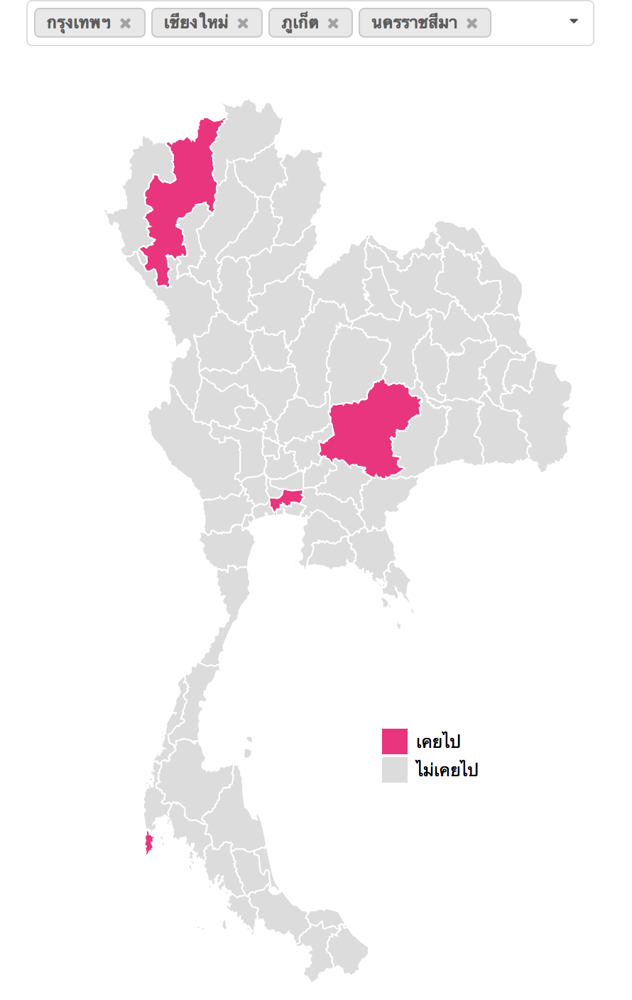

# ผมไปมาแล้วเชื่อผม (จังหวัดที่เคยไปในประเทศไทย)

A simple map to self-report visited Thai provinces. It went viral via sharing on Facebook. More than 300,000 maps created. 

Partially based on <https://gist.github.com/puripant/7cc6dcb82db482f61ee65c0a2e180a91> and <https://gist.github.com/michellechandra/0b2ce4923dc9b5809922>

